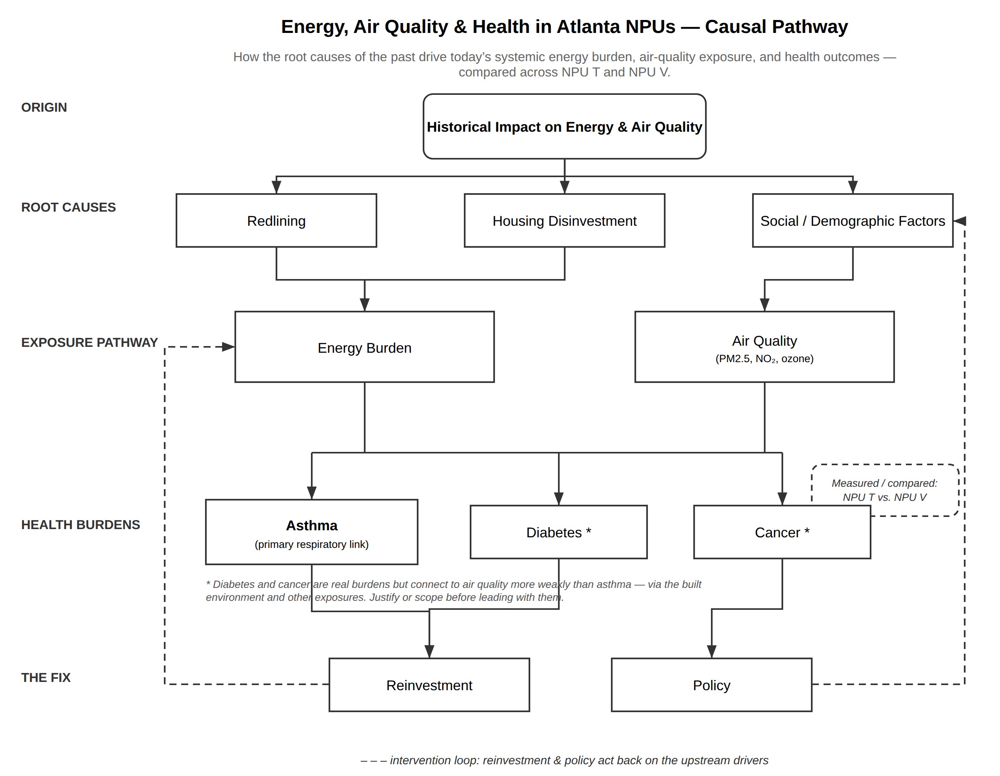

## Projects

### Energy Burden, Air Quality, and Health in Atlanta

A client project with Georgia Power under the Health Solutions Advisement Group, examining how energy choices shape air quality and health outcomes across Atlanta's neighborhood planning units. The work focuses on NPU T and NPU V, tracking asthma as the primary respiratory link alongside diabetes and cancer as secondary burdens, from 2020 to 2026. The framework traces the pathway from historical drivers like redlining and housing disinvestment through present-day energy burden and air quality exposure, and back again through reinvestment and policy.

{fig-align="center" width="100%" .lightbox}

### More Than A Run Club Health Survey Initiative

A community health survey initiative built around More Than A Run Club, using an existing space where people already gather to collect health data and surface needs that traditional outreach tends to miss. [Add a sentence here on what you're measuring and who it serves.]