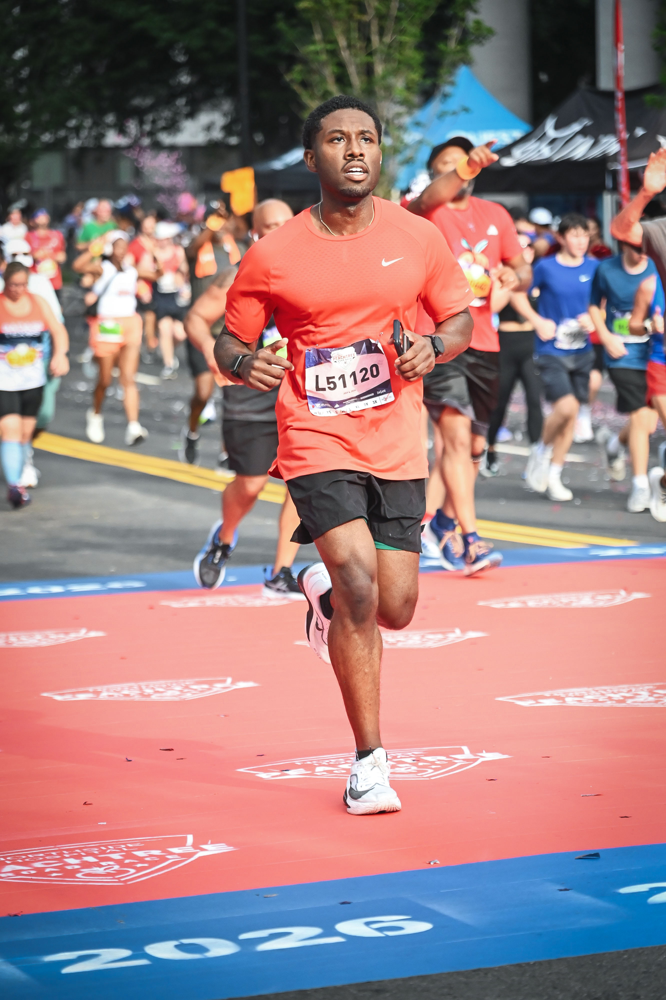

## Hi, I'm Theodore Brown Jr.

I was born in Washington, DC and grew up in Fredericksburg, Virginia. I earned my bachelor's degree in Biomedical sciences from Old Dominion University, and I'm now a Master of Public Health student at Morehouse School of Medicine (Class of 2027) and an intern with the Center of Excellence on Environmental Health and Sustainability.

My work sits at the meeting point of public health, technology, and the communities that carry the cost of both.

## What I'm working on

My current research develops a **Community-Negotiated Public Health Model for Fair Data Center Development and Management**. As AI infrastructure expands, data centers are being put in neighborhoods with little say in the decision and this development at data centers are being put in neighborhoods that have little say in the decision, and development at this unprecedented rate it carries potential environmental and health consequences.

I'm also part of a client project examining how energy choices shape air quality and health outcomes across Atlanta neighborhood planning units.

## What drives me

I'm interested in how environmental sustainability and emerging technologies shape social and behavioral health outcomes. That means asking who the technology serves, who absorbs its externalities, and what it would take to shift that balance. Long term, I want to bring these tools into  orthopedic and sports medicine care, and to build a health equity center in my own community.

## Leadership

- **Co-President**, Environmental Sustainability Interest Group
- **Secretary**, Sports Medicine Interest Group

Both roles let me do the part of this work I like most: getting people in a room and turning interest into something that actually moves.

## Outside of work

{width=400 fig-alt="Theodore running a race"}

Most mornings you'll find me running or in the gym, usually with old R&B playing. The rest of my time belongs to Wesley, my puppy
